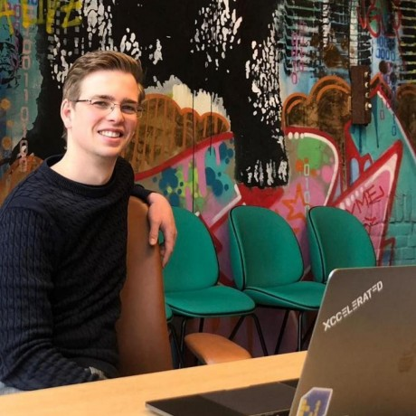

<pre>
Meta

This has to speak to two audiences well.

One audience people attending FaCCT, listening to the Radical AI podcast, and reading Design Justice.  It's most of the people involved in this project right now, and it's the people that will grow it in the early phase.  That audience is the heart and core of this work - it has to feel good about this project, and it has a lot of veto power it can use.  But it is not the primary audience.

The primary audience is people who do not particularly care about fairness.  They are data scientists or software engineers.  Maybe someday they'll also be designers and product managers, but not yet.  This is the site that someone who cares deeply about fairness can email to another engineer and say "let's pick something to try from what's here."

This audience has a shorter time horizon.  They are not academics.  Research papers signal that the project is not for them.
</pre>

# Fairness is a sociotechnical problem
Fairness in data science, machine learning, or any aspect of computer science is always challenging.  It involves balancing different stakeholders, translating between their vocabularies and perspectives, and finding ways to move forward that feels right to you and to everyone impacted by your work.

This makes the intake and discovery process in new projects particularly important.  It often involves coming into an unfamiliar domain and trying to understand it, while also building trust and confidence with your partners that your work can help them accomplish what they care about.

## I can haz PYthon cod enow!!
Most projects have limited time and budget.  But like distributed systems, cryptography algoriths, and authentication systems, fairness is often much more complicated than solving leetcode problems or running `pip install` and writing 3 lines of code :)

Each person and team needs to make their own tradeoffs.  But cutting corners on fairness can have the same kinds of severe unexpected consequences for a team as cutting corners on security.

## Try this now
1. Python functions for looking at the data
2. Talking about fairness
3. Noticing red flags
4. Introducing more sociotechnical context
5. Picking your first fairness metric
6. Diffusing solutionism
7. Walking away professionally

If you'd like more general guidelines and checklists for fairness in ML development:
- collaborating on ML design (PAIR Guidebook)
- co-designing with people impacted by your work (Design Justice)
- auditing datasets (Datasheets for datasets paper)
- describing limitations of models (Google Cloud model cards, paper)
- fairness questions throughout the ML lifecycle (Madaio)

## Domain-specific guides
a. Facial recognition
b. Criminal justice
c. Financial services
   - legal bits
   - Wattenberg visualization
   - need wider...?
d. Search and ranking
   - Harms of representation
   - Gorillas, Sloths and and Crossaints
e. Education
f. Health care
   - human costs of EMRs
   - people don't understand uncertainty
g. HR and Administration
   - choose your own adventure adminstrative horror

## Make a new friend!
These folks would love to take questions from data scientists trying to grow their work in fairness. They can help with things like:
- cutting through all the literature review
- recommending other collaborators in a specific field
- asking questions and spotting red flags

  
  
  
  
  
  
  
  
  

DM on Twitter or come to Gitter!

----

(CUT this)
## Understand specific hot-button topics
(If we get one paragraph, what are the top 3 *stories* everyone should know)
- ML designers can create systems that are racist or sexist without intending to or even knowing they have done this.  Watch this three minute video on a facial recognition (Gender Shades).
- There are many systems that are legal, but deeply unfair. (???)
- If the project involves labeling and classifying something, you are making choices about fairness. (???)

# Who to learn from
Practicing data scientists
-

Expanding your view of fairness
- Design Justice Principles

The important of sociotechnical context

History of fairness in computer science
- Trouble with Bias

# Where to learn
FAccT
Design Justice

ICML, AIES within AAAI, NeurIPS, ICLR, CHI

While human centered-AI primarily focuses on how humans will experience AI systems, and how their lives will be influenced by those AI systems, it also means considering